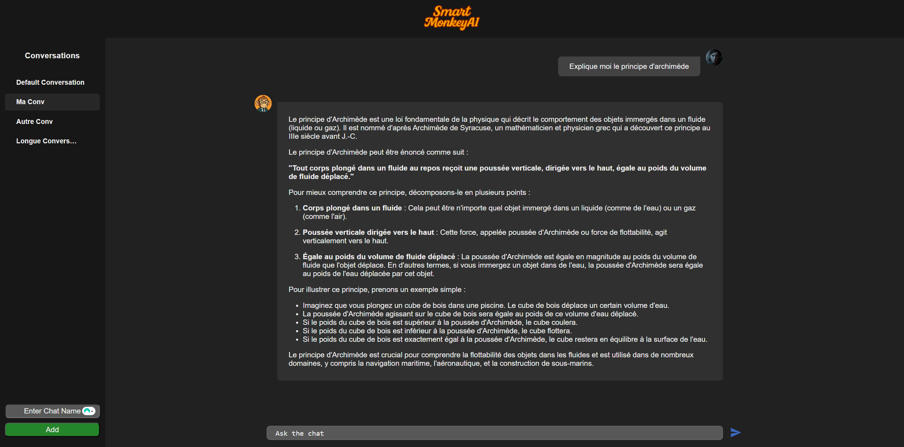
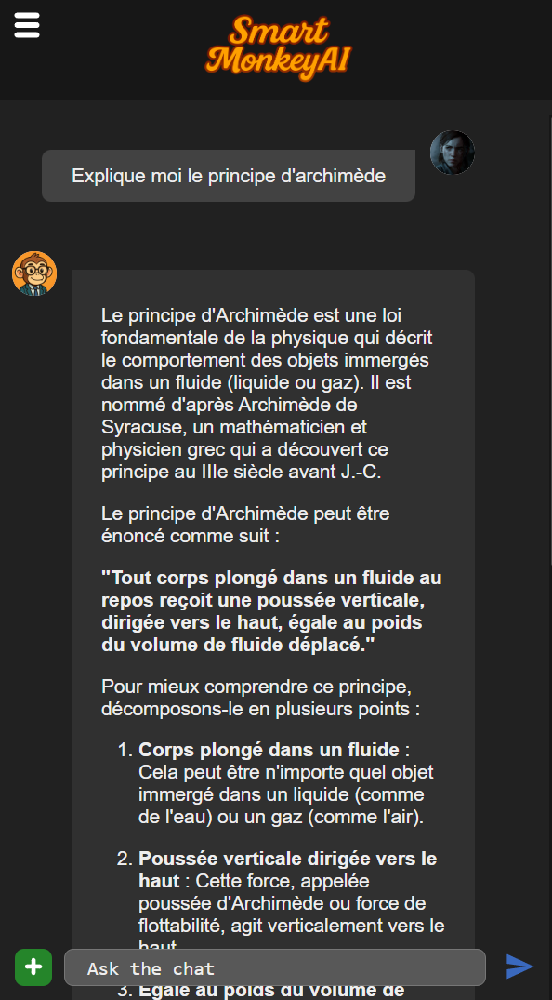

# SmartMonkeyAi

## Presentation

Smart Monkey is a front-end focused project done in a few days early during o'clock curriculum with the objective to display ability to communicate with external API (here Mistral AI API). Pocketbase has been used to manage the conversations database.
This is also my first project using Svelte.

Features include : Chat with Mistral using its API, creating seperates conversations and store all their datas in database

## Overview

Conversation with Mistral AI

---

With responsive design concerns

---
